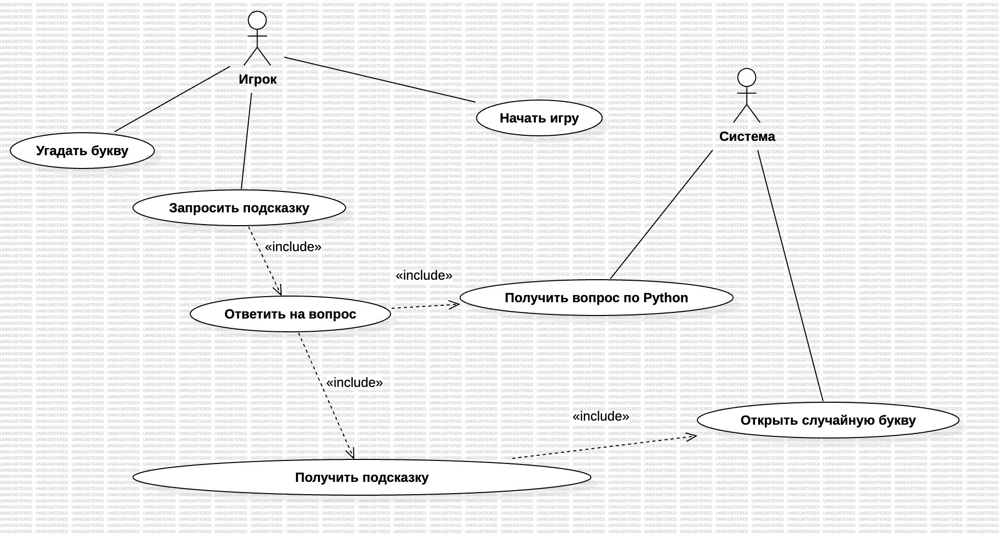
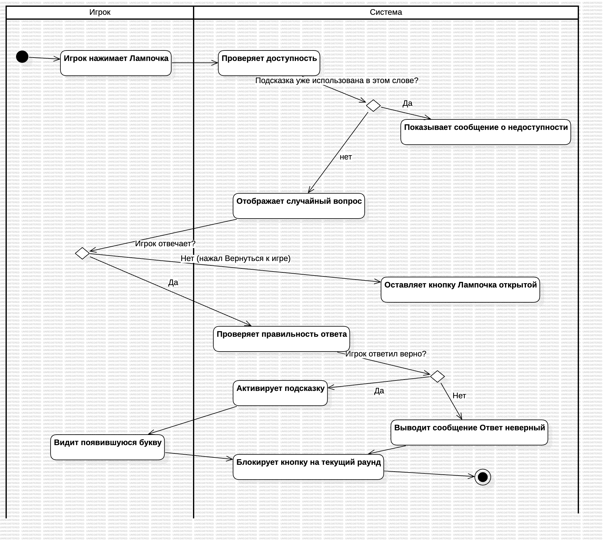
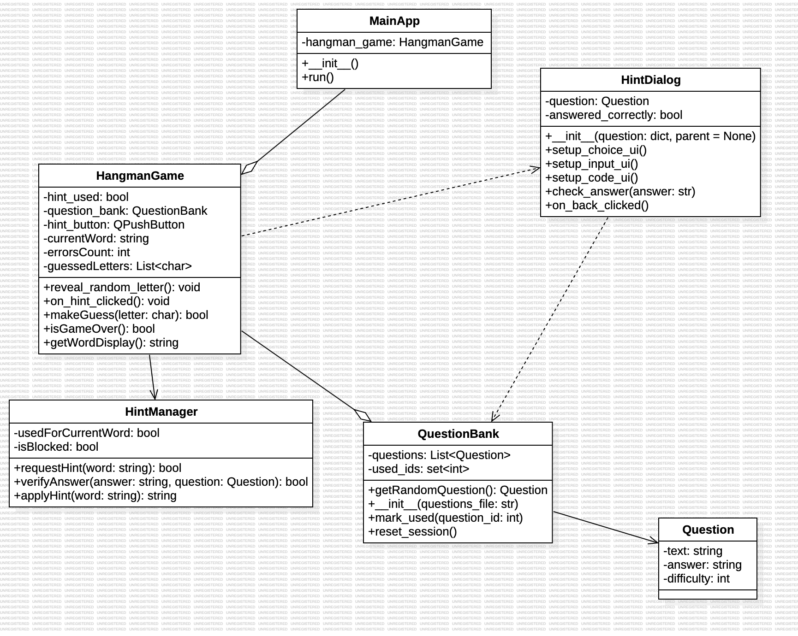

# Проект: Игра "Виселица" (Hangman)

## Общая архитектура

Игра реализует классическую механику «виселицы» с дополнительной системой подсказок через вопросы по Python.  
Игрок может использовать подсказку один раз за слово, но для этого нужно правильно ответить на случайный вопрос выбранной сложности.

В проекте выделены три ключевые диаграммы, описанные ниже.

## 1. Диаграмма вариантов использования (Use Case)

### Акторы:
| Актор | Роль |
|-------|------|
| **Игрок** | взаимодействует с интерфейсом, вводит буквы, выбирает сложность, запрашивает подсказки |
| **Система** | управляет вопросами, проверяет ответы, открывает буквы |

### Use Case и связи:
| Use Case | Тип | Связь |
|----------|-----|-------|
| Начать игру | базовое действие | |
| Угадать букву | базовое действие | |
| Выбрать сложность вопросов | базовое действие | выполняется до запроса подсказки |
| Запросить подсказку | базовое действие | `<<include>>` Ответить на вопрос |
| Ответить на вопрос | включаемое действие | `<<include>>` Получить подсказку |
| Получить подсказку | включаемое действие | `<<include>>` Открыть случайную букву |
| Получить вопрос по Python | расширяющее действие | `<<extend>>` (к Ответить на вопрос) |

### Зачем эта диаграмма:
Показывает функциональные требования и помогает не упустить ни одного сценария взаимодействия.

## 2. Диаграмма активностей (Activity)

### Основной поток (успешная подсказка):
1. Игрок нажимает кнопку «Лампочка»
2. Система проверяет, не использовалась ли подсказка в этом слове
3. Система отображает случайный вопроса выбранной игроком сложности
4. Игрок вводит ответ
5. Система проверяет ответ: при верном - активируется подсказка → открывается случайная буква
6. Кнопка подсказки блокируется до конца раунда

### Альтернативные потоки:
| Ситуация | Действие системы |
|----------|------------------|
| Подсказка уже использована в этом слове | Показывается сообщение о недоступности, кнопка не активна |
| Игрок ответил неверно | Показывается сообщение «Ответ неверный», кнопка блокируется |
| Игрок закрыл диалог (не ответил) | Диалог закрывается, кнопка «Лампочка» остаётся активной, подсказка не используется |

### Зачем эта диаграмма:
Описывает реальную логику работы функции подсказки с ветвлениями - полезна для разработчика при реализации.

## 3. Диаграмма классов (Class)

### Список классов и их назначение:

| Класс | Назначение |
|-------|------------|
| `MainApp` | Главное приложение, создаёт и показывает окно игры |
| `HangmanGame` | Основной игровой контроллер: слово, ошибки, угаданные буквы, логика подсказок |
| `QuestionBank` | Хранилище вопросов. Отслеживает использованные вопросы (used_ids) |
| `Question` | Модель вопроса: текст, правильный ответ, уровень сложности |
| `HintManager` | Управляет подсказками: проверяет доступность, применяет подсказку, верифицирует ответы |
| `HintDialog` | Qt-диалог отображения вопроса и получения ответа от игрока |

### Связи между классами:

| От | К | Тип | Пояснение |
|----|---|-----|-----------|
| `MainApp` | `HangmanGame` | Aggregation | Главное окно содержит виджет игры |
| `HangmanGame` | `QuestionBank` | Aggregation | Игра владеет банком вопросов |
| `HangmanGame` | `HintManager` | Association | Использует менеджер подсказок |
| `HangmanGame` | `HintDialog` | Dependency | Создаёт диалог при нажатии кнопки |
| `QuestionBank` | `Question` | Association | Хранит коллекцию объектов Question |
| `HintDialog` | `QuestionBank` | Dependency | Получает вопрос через игру |

### Зачем эта диаграмма:
Даёт полную картину архитектуры перед написанием кода: классы, их поля, методы и зависимости.

## Исходные файлы StarUML

- [usecase.mdj](usecase.mdj) — диаграмма вариантов использования  
- [activity.mdj](activity.mdj) — диаграмма активностей  
- [class.mdj](class.mdj) — диаграмма классов

Разработанные диаграммы полностью соответствуют требованиям и отражают все ключевые аспекты проектируемой системы подсказок в игре «Виселица».
