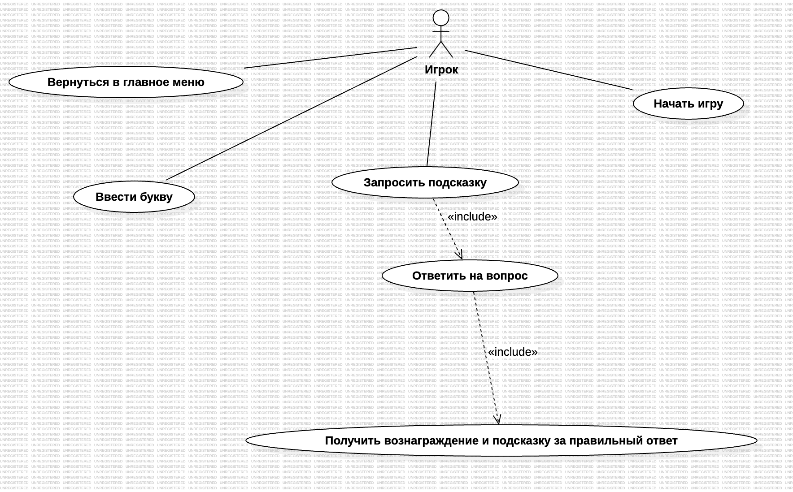

Проект: Игра "Виселица" (Hangman)

Диаграммы:

1. Диаграмма вариантов использования (Use Case)

Описание: 
Диаграмма вариантов использования показывает, какие действия может выполнять игрок в системе.  
Она выбрана, потому что позволяет наглядно представить функциональные требования к игре и взаимодействие игрока с системой на высоком уровне.

Что показано на диаграмме:  
Начать игру  
Ввести букву  
Запросить подсказку  
Ответить на вопрос  
Получить вознаграждение  
Вернуться в главное меню
  
2. Диаграмма активностей (Activity)

Описание: 
Диаграмма активностей описывает алгоритм работы функции "Подсказка" — от нажатия кнопки до получения буквы.  
Она выбрана, потому что лучше всего подходит для моделирования логики с ветвлениями (есть/нет, верно/неверно) и показывает последовательность действий в системе.

Что показано на диаграмме:  
Проверка доступности подсказки  
Выбор сложности вопроса  
Проверка правильности ответа  
Активация подсказки (появление буквы)  
Блокировка кнопки до следующего раунда

3. Диаграмма классов (Class)

Описание:  
Диаграмма классов показывает статическую структуру системы: какие классы есть, какие у них поля и методы, как они связаны между собой.  
Она выбрана, потому что является основной диаграммой для проектирования архитектуры программы перед написанием кода.

Что показано на диаграмме:
GameSession — управляет игрой (слово, ошибки, угаданные буквы)  
HintManager — отвечает за подсказки и проверку ответов  
QuestionBank — хранит коллекцию вопросов  
Question — модель вопроса (текст, ответ, сложность)

Эти три диаграммы покрывают все аспекты проекта: что делает система (Use Case), как работает ключевой алгоритм (Activity) и из каких классов состоит программа (Class).
